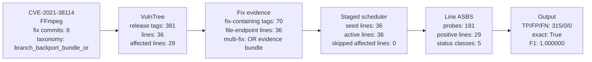
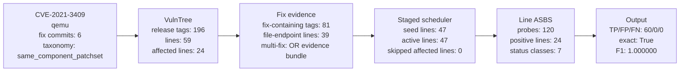
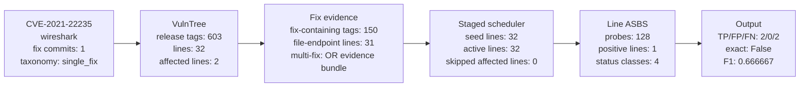
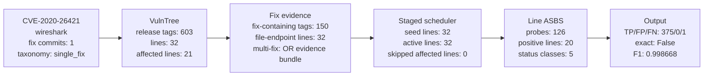
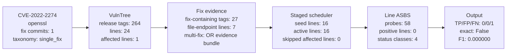
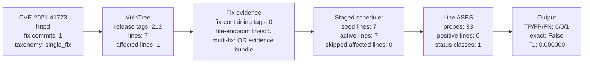
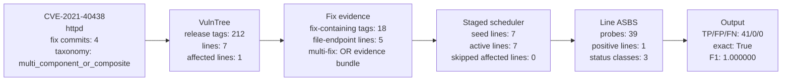
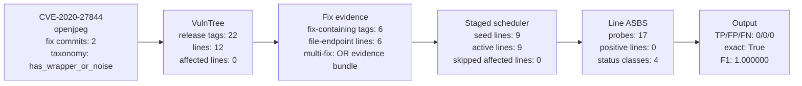

# Step3 Case Graphs: 10 Complex CVEs

This report visualizes the current Step3 design in `step3.md` on 10 complex CVEs.

Policy shown: `staged_nofix_stride3_file` with `sentinel_count=3`, `fixed_segment_sentinels=1`, and same-family expansion radius 1.

Important: these are GT-oracle simulations. `affected_version` is used as the ideal tag verdict oracle to explain planning logic. This is not a real-agent run.

Legend:

- `seed`: line selected before dynamic expansion.
- `active`: line actually evaluated after staged expansion.
- `positive`: line where ASBS predicted affected tags or probed an affected tag.
- `fix-tags`: release tags on that line that contain at least one strong fix evidence commit.

## Overview

| CVE | repo | why selected | commits | taxonomy | lines | active | affected lines | probes | TP/FP/FN | exact |
| --- | --- | --- | ---: | --- | ---: | ---: | ---: | ---: | --- | --- |
| `CVE-2020-13904` | FFmpeg | 15 commits; branch_backport_bundle_or; high-probe full-line case | 15 | `branch_backport_bundle_or` | 36 | 36 | 26 | 176 | 280/0/0 | True |
| `CVE-2021-38114` | FFmpeg | fixed-segment probe hit then fallback ASBS | 8 | `branch_backport_bundle_or` | 36 | 36 | 29 | 181 | 315/0/0 | True |
| `CVE-2021-3409` | qemu | same_component_patchset; many qemu lines | 6 | `same_component_patchset` | 59 | 47 | 24 | 120 | 60/0/0 | True |
| `CVE-2021-3416` | qemu | 10 commits; component-level patchset | 10 | `same_component_patchset` | 59 | 53 | 28 | 130 | 71/0/0 | True |
| `CVE-2021-22235` | wireshark | current FN case; sparse affected tags | 1 | `single_fix` | 32 | 32 | 2 | 128 | 2/0/2 | False |
| `CVE-2020-26421` | wireshark | large affected set with one residual FN | 1 | `single_fix` | 32 | 32 | 21 | 126 | 375/0/1 | False |
| `CVE-2022-2274` | openssl | OpenSSL line-family complexity; residual FN | 1 | `single_fix` | 24 | 16 | 1 | 58 | 0/0/1 | False |
| `CVE-2021-41773` | httpd | single affected release missed by endpoint/sentinel | 1 | `single_fix` | 7 | 7 | 1 | 33 | 0/0/1 | False |
| `CVE-2021-40438` | httpd | multi_component_or_composite taxonomy | 4 | `multi_component_or_composite` | 7 | 7 | 1 | 39 | 41/0/0 | True |
| `CVE-2020-27844` | openjpeg | wrapper/merge commit evidence case | 2 | `has_wrapper_or_noise` | 12 | 9 | 0 | 17 | 0/0/0 | True |

## 1. CVE-2020-13904 (FFmpeg)

Reason selected: 15 commits; branch_backport_bundle_or; high-probe full-line case.

### Key Facts

- Dataset affected_version count: `280`.
- Mapped GT tags: `280`; unmapped GT tags: `0`.
- Fix commits: `15`; taxonomy: `branch_backport_bundle_or`.
- Fix evidence tags: `79`; touched-file endpoint lines: `30`.
- Changed-file top dirs: `{'libavformat': 1}`.
- Scheduler: seed lines `33`, active lines `36`, affected lines `26`, skipped affected lines `0`.
- Output: TP `280`, FP `0`, FN `0`, exact `True`, F1 `1.000000`.

### Line Graph Summary

| line | tags | GT shape | GT interval | GT tags | seed | active | positive | fix-tags |
| --- | ---: | --- | --- | ---: | --- | --- | --- | ---: |
| `0.10` | 17 | `full` | n0.10..n0.10.16 | 17 | Y | Y | Y | 0 |
| `0.11` | 6 | `full` | n0.11..n0.11.5 | 6 | Y | Y | Y | 0 |
| `0.5` | 15 | `no_affected` | - | 0 | Y | Y | N | 0 |
| `0.7` | 17 | `full` | n0.7.1..n0.7.17 | 17 | N | Y | Y | 0 |
| `0.8` | 16 | `full` | n0.8..n0.8.15 | 16 | Y | Y | Y | 0 |
| `0.9` | 5 | `full` | n0.9..n0.9.4 | 5 | N | Y | Y | 0 |
| `1.0` | 11 | `full` | n1.0..n1.0.10 | 11 | Y | Y | Y | 0 |
| `1.1` | 17 | `full` | n1.1..n1.1.16 | 17 | Y | Y | Y | 0 |
| `1.2` | 13 | `full` | n1.2..n1.2.12 | 13 | Y | Y | Y | 0 |
| `2.0` | 8 | `full` | n2.0..n2.0.7 | 8 | Y | Y | Y | 0 |
| `2.1` | 9 | `full` | n2.1..n2.1.8 | 9 | Y | Y | Y | 0 |
| `2.2` | 17 | `full` | n2.2..n2.2.16 | 17 | Y | Y | Y | 0 |
| `2.3` | 7 | `full` | n2.3..n2.3.6 | 7 | Y | Y | Y | 0 |
| `2.4` | 15 | `full` | n2.4..n2.4.14 | 15 | Y | Y | Y | 0 |
| `2.5` | 12 | `full` | n2.5..n2.5.11 | 12 | Y | Y | Y | 0 |
| `2.6` | 10 | `full` | n2.6..n2.6.9 | 10 | Y | Y | Y | 0 |
| `2.7` | 8 | `full` | n2.7..n2.7.7 | 8 | Y | Y | Y | 0 |
| `2.8` | 23 | `prefix` | n2.8..n2.8.16 | 17 | Y | Y | Y | 6 |
| ... | ... | ... | showing 18/35 lines | ... | ... | ... | ... | ... |

### ASBS / Scheduler Status

| ASBS/scheduler status | count |
| --- | ---: |
| `aa_full_segment_inferred` | 25 |
| `fixed_segment_probe_clear` | 15 |
| `nn_no_affected_inferred` | 2 |
| `singleton` | 1 |

## 2. CVE-2021-38114 (FFmpeg)

Reason selected: fixed-segment probe hit then fallback ASBS.

### Key Facts

- Dataset affected_version count: `315`.
- Mapped GT tags: `315`; unmapped GT tags: `0`.
- Fix commits: `8`; taxonomy: `branch_backport_bundle_or`.
- Fix evidence tags: `70`; touched-file endpoint lines: `36`.
- Changed-file top dirs: `{'libavcodec': 1}`.
- Scheduler: seed lines `36`, active lines `36`, affected lines `29`, skipped affected lines `0`.
- Output: TP `315`, FP `0`, FN `0`, exact `True`, F1 `1.000000`.

### Line Graph Summary

| line | tags | GT shape | GT interval | GT tags | seed | active | positive | fix-tags |
| --- | ---: | --- | --- | ---: | --- | --- | --- | ---: |
| `0.10` | 17 | `full` | n0.10..n0.10.16 | 17 | Y | Y | Y | 0 |
| `0.11` | 6 | `full` | n0.11..n0.11.5 | 6 | Y | Y | Y | 0 |
| `0.5` | 15 | `full` | n0.5.5..v0.5.3 | 15 | Y | Y | Y | 0 |
| `0.6` | 7 | `full` | n0.6.4..v0.6.1 | 7 | Y | Y | Y | 0 |
| `0.7` | 17 | `full` | n0.7.1..n0.7.17 | 17 | Y | Y | Y | 0 |
| `0.8` | 16 | `full` | n0.8..n0.8.15 | 16 | Y | Y | Y | 0 |
| `0.9` | 5 | `full` | n0.9..n0.9.4 | 5 | Y | Y | Y | 0 |
| `1.0` | 11 | `full` | n1.0..n1.0.10 | 11 | Y | Y | Y | 0 |
| `1.1` | 17 | `full` | n1.1..n1.1.16 | 17 | Y | Y | Y | 0 |
| `1.2` | 13 | `full` | n1.2..n1.2.12 | 13 | Y | Y | Y | 0 |
| `2.0` | 8 | `full` | n2.0..n2.0.7 | 8 | Y | Y | Y | 0 |
| `2.1` | 9 | `full` | n2.1..n2.1.8 | 9 | Y | Y | Y | 0 |
| `2.2` | 17 | `full` | n2.2..n2.2.16 | 17 | Y | Y | Y | 0 |
| `2.3` | 7 | `full` | n2.3..n2.3.6 | 7 | Y | Y | Y | 0 |
| `2.4` | 15 | `full` | n2.4..n2.4.14 | 15 | Y | Y | Y | 0 |
| `2.5` | 12 | `full` | n2.5..n2.5.11 | 12 | Y | Y | Y | 0 |
| `2.6` | 10 | `full` | n2.6..n2.6.9 | 10 | Y | Y | Y | 0 |
| `2.7` | 8 | `full` | n2.7..n2.7.7 | 8 | Y | Y | Y | 0 |
| ... | ... | ... | showing 18/36 lines | ... | ... | ... | ... | ... |

### ASBS / Scheduler Status

| ASBS/scheduler status | count |
| --- | ---: |
| `aa_full_segment_inferred` | 28 |
| `fixed_segment_probe_clear` | 13 |
| `fallback_an_prefix_boundary` | 1 |
| `fixed_segment_probe_hit` | 1 |
| `singleton` | 1 |

## 3. CVE-2021-3409 (qemu)

Reason selected: same_component_patchset; many qemu lines.

### Key Facts

- Dataset affected_version count: `60`.
- Mapped GT tags: `60`; unmapped GT tags: `0`.
- Fix commits: `6`; taxonomy: `same_component_patchset`.
- Fix evidence tags: `81`; touched-file endpoint lines: `39`.
- Changed-file top dirs: `{'hw': 1}`.
- Scheduler: seed lines `47`, active lines `47`, affected lines `24`, skipped affected lines `0`.
- Output: TP `60`, FP `0`, FN `0`, exact `True`, F1 `1.000000`.

### Line Graph Summary

| line | tags | GT shape | GT interval | GT tags | seed | active | positive | fix-tags |
| --- | ---: | --- | --- | ---: | --- | --- | --- | ---: |
| `0.1` | 6 | `no_affected` | - | 0 | Y | Y | N | 0 |
| `0.10` | 7 | `no_affected` | - | 0 | Y | Y | N | 0 |
| `0.13` | 1 | `no_affected` | - | 0 | Y | Y | N | 0 |
| `0.4` | 5 | `no_affected` | - | 0 | Y | Y | N | 0 |
| `0.7` | 2 | `no_affected` | - | 0 | Y | Y | N | 0 |
| `1.0` | 2 | `no_affected` | - | 0 | Y | Y | N | 0 |
| `1.3` | 2 | `no_affected` | - | 0 | Y | Y | N | 0 |
| `1.4` | 3 | `no_affected` | - | 0 | Y | Y | N | 0 |
| `1.5` | 4 | `full` | v1.5.0..v1.5.3 | 4 | Y | Y | Y | 0 |
| `1.6` | 3 | `full` | v1.6.0..v1.6.2 | 3 | Y | Y | Y | 0 |
| `1.7` | 3 | `full` | v1.7.0..v1.7.2 | 3 | Y | Y | Y | 0 |
| `10.0` | 8 | `no_affected` | - | 0 | Y | Y | N | 8 |
| `10.1` | 4 | `no_affected` | - | 0 | Y | Y | N | 4 |
| `10.2` | 1 | `no_affected` | - | 0 | Y | Y | N | 1 |
| `2.0` | 3 | `full` | v2.0.0..v2.0.2 | 3 | Y | Y | Y | 0 |
| `2.1` | 4 | `full` | v2.1.0..v2.1.3 | 4 | Y | Y | Y | 0 |
| `2.10` | 3 | `full` | v2.10.0..v2.10.2 | 3 | Y | Y | Y | 0 |
| `2.11` | 3 | `full` | v2.11.0..v2.11.2 | 3 | Y | Y | Y | 0 |
| ... | ... | ... | showing 18/47 lines | ... | ... | ... | ... | ... |

### ASBS / Scheduler Status

| ASBS/scheduler status | count |
| --- | ---: |
| `aa_full_segment_inferred` | 22 |
| `fixed_segment_probe_clear` | 15 |
| `skipped_line` | 12 |
| `nn_no_affected_inferred` | 7 |
| `singleton` | 2 |
| `fallback_singleton` | 1 |
| `fixed_segment_probe_hit` | 1 |

## 4. CVE-2021-3416 (qemu)

Reason selected: 10 commits; component-level patchset.

### Key Facts

- Dataset affected_version count: `71`.
- Mapped GT tags: `71`; unmapped GT tags: `0`.
- Fix commits: `10`; taxonomy: `same_component_patchset`.
- Fix evidence tags: `80`; touched-file endpoint lines: `48`.
- Changed-file top dirs: `{'hw': 9, 'include': 2, 'net': 2}`.
- Scheduler: seed lines `53`, active lines `53`, affected lines `28`, skipped affected lines `0`.
- Output: TP `71`, FP `0`, FN `0`, exact `True`, F1 `1.000000`.

### Line Graph Summary

| line | tags | GT shape | GT interval | GT tags | seed | active | positive | fix-tags |
| --- | ---: | --- | --- | ---: | --- | --- | --- | ---: |
| `0.1` | 6 | `no_affected` | - | 0 | Y | Y | N | 0 |
| `0.11` | 2 | `no_affected` | - | 0 | Y | Y | N | 0 |
| `0.12` | 6 | `no_affected` | - | 0 | Y | Y | N | 0 |
| `0.13` | 1 | `no_affected` | - | 0 | Y | Y | N | 0 |
| `0.14` | 2 | `no_affected` | - | 0 | Y | Y | N | 0 |
| `0.15` | 2 | `no_affected` | - | 0 | Y | Y | N | 0 |
| `0.2` | 1 | `no_affected` | - | 0 | Y | Y | N | 0 |
| `0.5` | 2 | `no_affected` | - | 0 | Y | Y | N | 0 |
| `0.8` | 2 | `no_affected` | - | 0 | Y | Y | N | 0 |
| `1.0` | 2 | `no_affected` | - | 0 | Y | Y | N | 0 |
| `1.1` | 3 | `full` | v1.1.0..v1.1.2 | 3 | Y | Y | Y | 0 |
| `1.2` | 3 | `full` | v1.2.0..v1.2.2 | 3 | Y | Y | Y | 0 |
| `1.3` | 2 | `full` | v1.3.0..v1.3.1 | 2 | Y | Y | Y | 0 |
| `1.4` | 3 | `full` | v1.4.0..v1.4.2 | 3 | Y | Y | Y | 0 |
| `1.5` | 4 | `full` | v1.5.0..v1.5.3 | 4 | Y | Y | Y | 0 |
| `1.6` | 3 | `full` | v1.6.0..v1.6.2 | 3 | Y | Y | Y | 0 |
| `1.7` | 3 | `full` | v1.7.0..v1.7.2 | 3 | Y | Y | Y | 0 |
| `10.0` | 8 | `no_affected` | - | 0 | Y | Y | N | 8 |
| ... | ... | ... | showing 18/53 lines | ... | ... | ... | ... | ... |

### ASBS / Scheduler Status

| ASBS/scheduler status | count |
| --- | ---: |
| `aa_full_segment_inferred` | 26 |
| `fixed_segment_probe_clear` | 15 |
| `nn_no_affected_inferred` | 8 |
| `skipped_line` | 6 |
| `singleton` | 4 |

## 5. CVE-2021-22235 (wireshark)

Reason selected: current FN case; sparse affected tags.

### Key Facts

- Dataset affected_version count: `4`.
- Mapped GT tags: `4`; unmapped GT tags: `0`.
- Fix commits: `1`; taxonomy: `single_fix`.
- Fix evidence tags: `150`; touched-file endpoint lines: `31`.
- Changed-file top dirs: `{'epan': 1}`.
- Scheduler: seed lines `32`, active lines `32`, affected lines `2`, skipped affected lines `0`.
- Output: TP `2`, FP `0`, FN `2`, exact `False`, F1 `0.666667`.

### Line Graph Summary

| line | tags | GT shape | GT interval | GT tags | seed | active | positive | fix-tags |
| --- | ---: | --- | --- | ---: | --- | --- | --- | ---: |
| `0.99` | 7 | `no_affected` | - | 0 | Y | Y | N | 0 |
| `1.0` | 17 | `no_affected` | - | 0 | Y | Y | N | 0 |
| `1.10` | 30 | `no_affected` | - | 0 | Y | Y | N | 0 |
| `1.11` | 5 | `no_affected` | - | 0 | Y | Y | N | 0 |
| `1.12` | 28 | `no_affected` | - | 0 | Y | Y | N | 0 |
| `1.2` | 19 | `no_affected` | - | 0 | Y | Y | N | 0 |
| `1.4` | 16 | `no_affected` | - | 0 | Y | Y | N | 0 |
| `1.6` | 17 | `no_affected` | - | 0 | Y | Y | N | 0 |
| `1.8` | 32 | `no_affected` | - | 0 | Y | Y | N | 0 |
| `1.99` | 20 | `no_affected` | - | 0 | Y | Y | N | 0 |
| `2.0` | 34 | `no_affected` | - | 0 | Y | Y | N | 0 |
| `2.1` | 4 | `no_affected` | - | 0 | Y | Y | N | 0 |
| `2.2` | 36 | `no_affected` | - | 0 | Y | Y | N | 0 |
| `2.4` | 34 | `no_affected` | - | 0 | Y | Y | N | 0 |
| `2.5` | 3 | `no_affected` | - | 0 | Y | Y | N | 0 |
| `2.6` | 42 | `no_affected` | - | 0 | Y | Y | N | 0 |
| `2.9` | 1 | `no_affected` | - | 0 | Y | Y | N | 0 |
| `3.0` | 30 | `no_affected` | - | 0 | Y | Y | N | 0 |
| ... | ... | ... | showing 18/32 lines | ... | ... | ... | ... | ... |

### ASBS / Scheduler Status

| ASBS/scheduler status | count |
| --- | ---: |
| `nn_no_affected_inferred` | 21 |
| `fixed_segment_probe_clear` | 9 |
| `nn_middle_interval_inferred` | 1 |
| `singleton` | 1 |

## 6. CVE-2020-26421 (wireshark)

Reason selected: large affected set with one residual FN.

### Key Facts

- Dataset affected_version count: `376`.
- Mapped GT tags: `376`; unmapped GT tags: `0`.
- Fix commits: `1`; taxonomy: `single_fix`.
- Fix evidence tags: `150`; touched-file endpoint lines: `32`.
- Changed-file top dirs: `{'epan': 1}`.
- Scheduler: seed lines `32`, active lines `32`, affected lines `21`, skipped affected lines `0`.
- Output: TP `375`, FP `0`, FN `1`, exact `False`, F1 `0.998668`.

### Line Graph Summary

| line | tags | GT shape | GT interval | GT tags | seed | active | positive | fix-tags |
| --- | ---: | --- | --- | ---: | --- | --- | --- | ---: |
| `0.99` | 7 | `no_affected` | - | 0 | Y | Y | N | 0 |
| `1.0` | 17 | `middle` | wireshark-1.0.2 | 1 | Y | Y | N | 0 |
| `1.10` | 30 | `full` | v1.10.0..v1.10.14 | 30 | Y | Y | Y | 0 |
| `1.11` | 5 | `full` | v1.11.0..v1.11.3 | 5 | Y | Y | Y | 0 |
| `1.12` | 28 | `full` | wireshark-1.12.0..v1.12.13 | 28 | Y | Y | Y | 0 |
| `1.2` | 19 | `full` | wireshark-1.2.0..wireshark-1.2.18 | 19 | Y | Y | Y | 0 |
| `1.4` | 16 | `full` | wireshark-1.4.0..wireshark-1.4.15 | 16 | Y | Y | Y | 0 |
| `1.6` | 17 | `full` | wireshark-1.6.0..wireshark-1.6.16 | 17 | Y | Y | Y | 0 |
| `1.8` | 32 | `full` | v1.8.0..v1.8.15 | 32 | Y | Y | Y | 0 |
| `1.99` | 20 | `full` | wireshark-1.99.0..v1.99.9 | 20 | Y | Y | Y | 0 |
| `2.0` | 34 | `full` | wireshark-2.0.0..v2.0.16 | 34 | Y | Y | Y | 0 |
| `2.1` | 4 | `full` | wireshark-2.1.0..v2.1.1 | 4 | Y | Y | Y | 0 |
| `2.2` | 36 | `full` | wireshark-2.2.0..v2.2.17 | 36 | Y | Y | Y | 0 |
| `2.4` | 34 | `full` | wireshark-2.4.0..v2.4.16 | 34 | Y | Y | Y | 0 |
| `2.5` | 3 | `full` | wireshark-2.5.0..v2.5.1 | 3 | Y | Y | Y | 0 |
| `2.6` | 42 | `full` | wireshark-2.6.0..v2.6.20 | 42 | Y | Y | Y | 0 |
| `2.9` | 1 | `full` | v2.9.0 | 1 | Y | Y | Y | 0 |
| `3.0` | 30 | `full` | wireshark-3.0.0..v3.0.14 | 30 | Y | Y | Y | 0 |
| ... | ... | ... | showing 18/32 lines | ... | ... | ... | ... | ... |

### ASBS / Scheduler Status

| ASBS/scheduler status | count |
| --- | ---: |
| `aa_full_segment_inferred` | 17 |
| `fixed_segment_probe_clear` | 9 |
| `nn_no_affected_inferred` | 3 |
| `an_prefix_boundary` | 2 |
| `singleton` | 1 |

## 7. CVE-2022-2274 (openssl)

Reason selected: OpenSSL line-family complexity; residual FN.

### Key Facts

- Dataset affected_version count: `1`.
- Mapped GT tags: `1`; unmapped GT tags: `0`.
- Fix commits: `1`; taxonomy: `single_fix`.
- Fix evidence tags: `27`; touched-file endpoint lines: `7`.
- Changed-file top dirs: `{'crypto': 1}`.
- Scheduler: seed lines `16`, active lines `16`, affected lines `1`, skipped affected lines `0`.
- Output: TP `0`, FP `0`, FN `1`, exact `False`, F1 `0.000000`.

### Line Graph Summary

| line | tags | GT shape | GT interval | GT tags | seed | active | positive | fix-tags |
| --- | ---: | --- | --- | ---: | --- | --- | --- | ---: |
| `0.9.1` | 1 | `no_affected` | - | 0 | Y | Y | N | 0 |
| `0.9.3` | 2 | `no_affected` | - | 0 | Y | Y | N | 0 |
| `0.9.6` | 14 | `no_affected` | - | 0 | Y | Y | N | 0 |
| `1.0.0` | 21 | `no_affected` | - | 0 | Y | Y | N | 0 |
| `1.1.0` | 13 | `no_affected` | - | 0 | Y | Y | N | 0 |
| `1.1.1` | 24 | `no_affected` | - | 0 | Y | Y | N | 0 |
| `3.0` | 20 | `middle` | openssl-3.0.4 | 1 | Y | Y | N | 0 |
| `3.1` | 9 | `no_affected` | - | 0 | Y | Y | N | 0 |
| `3.2` | 7 | `no_affected` | - | 0 | Y | Y | N | 7 |
| `3.3` | 7 | `no_affected` | - | 0 | Y | Y | N | 7 |
| `3.4` | 5 | `no_affected` | - | 0 | Y | Y | N | 5 |
| `3.5` | 6 | `no_affected` | - | 0 | Y | Y | N | 6 |
| `3.6` | 2 | `no_affected` | - | 0 | Y | Y | N | 2 |
| `engine-0.9.6` | 14 | `no_affected` | - | 0 | Y | Y | N | 0 |
| `fips-1.0` | 1 | `no_affected` | - | 0 | Y | Y | N | 0 |
| `fips-2.0` | 18 | `no_affected` | - | 0 | Y | Y | N | 0 |

### ASBS / Scheduler Status

| ASBS/scheduler status | count |
| --- | ---: |
| `nn_no_affected_inferred` | 9 |
| `skipped_line` | 8 |
| `fixed_segment_probe_clear` | 5 |
| `singleton` | 2 |

## 8. CVE-2021-41773 (httpd)

Reason selected: single affected release missed by endpoint/sentinel.

### Key Facts

- Dataset affected_version count: `1`.
- Mapped GT tags: `1`; unmapped GT tags: `0`.
- Fix commits: `1`; taxonomy: `single_fix`.
- Fix evidence tags: `0`; touched-file endpoint lines: `5`.
- Changed-file top dirs: `{'changes-entries': 1, 'server': 1}`.
- Scheduler: seed lines `7`, active lines `7`, affected lines `1`, skipped affected lines `0`.
- Output: TP `0`, FP `0`, FN `1`, exact `False`, F1 `0.000000`.

### Line Graph Summary

| line | tags | GT shape | GT interval | GT tags | seed | active | positive | fix-tags |
| --- | ---: | --- | --- | ---: | --- | --- | --- | ---: |
| `1.2` | 3 | `no_affected` | - | 0 | Y | Y | N | 0 |
| `1.3` | 15 | `no_affected` | - | 0 | Y | Y | N | 0 |
| `2.0` | 65 | `no_affected` | - | 0 | Y | Y | N | 0 |
| `2.1` | 10 | `no_affected` | - | 0 | Y | Y | N | 0 |
| `2.2` | 35 | `no_affected` | - | 0 | Y | Y | N | 0 |
| `2.3` | 17 | `no_affected` | - | 0 | Y | Y | N | 0 |
| `2.4` | 67 | `middle` | 2.4.49 | 1 | Y | Y | N | 0 |

### ASBS / Scheduler Status

| ASBS/scheduler status | count |
| --- | ---: |
| `nn_no_affected_inferred` | 7 |

## 9. CVE-2021-40438 (httpd)

Reason selected: multi_component_or_composite taxonomy.

### Key Facts

- Dataset affected_version count: `41`.
- Mapped GT tags: `41`; unmapped GT tags: `0`.
- Fix commits: `4`; taxonomy: `multi_component_or_composite`.
- Fix evidence tags: `18`; touched-file endpoint lines: `5`.
- Changed-file top dirs: `{'changes-entries': 3, 'modules': 3, 'STATUS': 1}`.
- Scheduler: seed lines `7`, active lines `7`, affected lines `1`, skipped affected lines `0`.
- Output: TP `41`, FP `0`, FN `0`, exact `True`, F1 `1.000000`.

### Line Graph Summary

| line | tags | GT shape | GT interval | GT tags | seed | active | positive | fix-tags |
| --- | ---: | --- | --- | ---: | --- | --- | --- | ---: |
| `1.2` | 3 | `no_affected` | - | 0 | Y | Y | N | 0 |
| `1.3` | 15 | `no_affected` | - | 0 | Y | Y | N | 0 |
| `2.0` | 65 | `no_affected` | - | 0 | Y | Y | N | 0 |
| `2.1` | 10 | `no_affected` | - | 0 | Y | Y | N | 0 |
| `2.2` | 35 | `no_affected` | - | 0 | Y | Y | N | 0 |
| `2.3` | 17 | `no_affected` | - | 0 | Y | Y | N | 0 |
| `2.4` | 67 | `middle` | 2.4.8..2.4.48 | 41 | Y | Y | Y | 18 |

### ASBS / Scheduler Status

| ASBS/scheduler status | count |
| --- | ---: |
| `nn_no_affected_inferred` | 6 |
| `fixed_segment_probe_clear` | 1 |
| `na_suffix_boundary` | 1 |

## 10. CVE-2020-27844 (openjpeg)

Reason selected: wrapper/merge commit evidence case.

### Key Facts

- Dataset affected_version count: `0`.
- Mapped GT tags: `0`; unmapped GT tags: `0`.
- Fix commits: `2`; taxonomy: `has_wrapper_or_noise`.
- Fix evidence tags: `6`; touched-file endpoint lines: `6`.
- Changed-file top dirs: `{'src': 1}`.
- Scheduler: seed lines `9`, active lines `9`, affected lines `0`, skipped affected lines `0`.
- Output: TP `0`, FP `0`, FN `0`, exact `True`, F1 `1.000000`.

### Line Graph Summary

| line | tags | GT shape | GT interval | GT tags | seed | active | positive | fix-tags |
| --- | ---: | --- | --- | ---: | --- | --- | --- | ---: |
| `1.0` | 1 | `no_affected` | - | 0 | Y | Y | N | 0 |
| `1.3` | 1 | `no_affected` | - | 0 | Y | Y | N | 0 |
| `1.5` | 3 | `no_affected` | - | 0 | Y | Y | N | 0 |
| `2.0` | 2 | `no_affected` | - | 0 | Y | Y | N | 0 |
| `2.1` | 3 | `no_affected` | - | 0 | Y | Y | N | 0 |
| `2.2` | 1 | `no_affected` | - | 0 | Y | Y | N | 0 |
| `2.3` | 2 | `no_affected` | - | 0 | Y | Y | N | 0 |
| `2.4` | 1 | `no_affected` | - | 0 | Y | Y | N | 1 |
| `2.5` | 5 | `no_affected` | - | 0 | Y | Y | N | 5 |

### ASBS / Scheduler Status

| ASBS/scheduler status | count |
| --- | ---: |
| `nn_no_affected_inferred` | 4 |
| `singleton` | 3 |
| `skipped_line` | 3 |
| `fixed_segment_probe_clear` | 2 |

