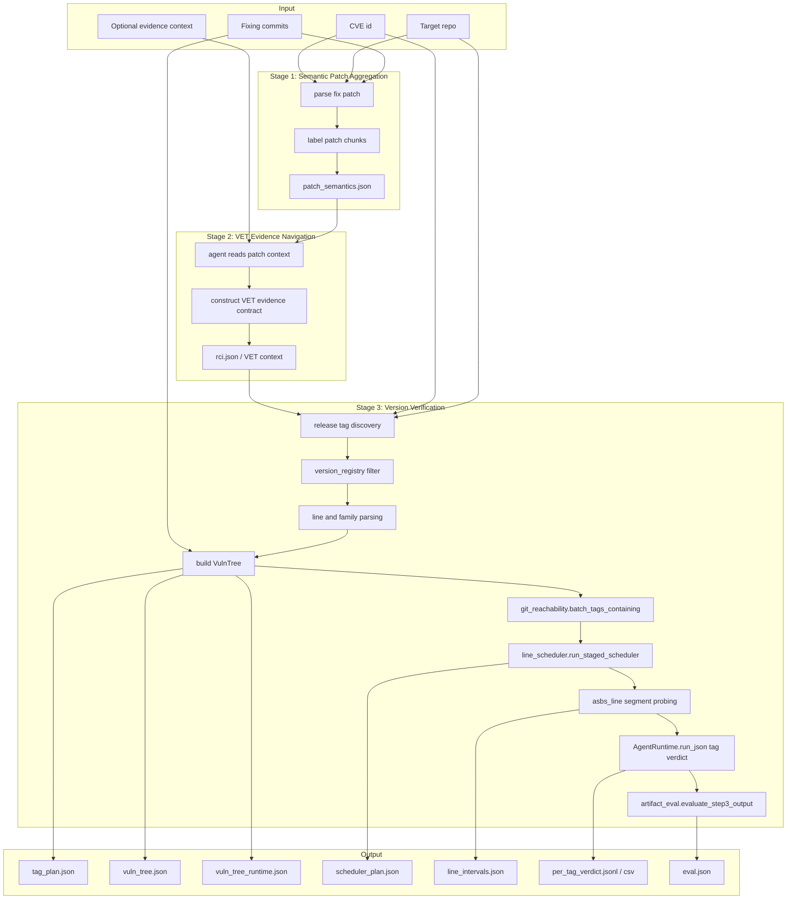

# VulnVersion

VulnVersion 是一个面向开源项目的漏洞影响版本识别系统。给定 `CVE + fixing commits + target repository`，系统识别该 CVE 影响的 release versions，并输出可评估、可复现的 artifacts。

当前代码以 **OpenCode Agent** 作为可执行 agent backend。Codex 与 Claude Code backend 正在开发中，后续用于对比实验与替换式评估。

---

## 1. 部署流程

### 1.1 获取代码

```bash
git clone git@github.com:Jimi-Lab/VulnVersion.git ~/VulnVersion
cd ~/VulnVersion
```

### 1.2 构建 Docker 镜像

Dockerfile 路径：

```text
docker/Internet/Dockerfile
```

在项目根目录执行：

```bash
docker build -f docker/Internet/Dockerfile -t vulnversion-internet:latest .
```

### 1.3 配置运行环境

复制环境变量模板：

```bash
cp docker/Internet/.env.example my-runtime.env
```

编辑 `my-runtime.env`，配置 OpenCode / LLM 相关参数。示例：

```env
OPENAI_BASE_URL=https://<your-host>/v1
OPENAI_API_KEY=sk-***
OPENCODE_MODEL_ID=deepseek-chat
```

### 1.4 运行 Docker

最小运行示例：

```bash
docker run --rm -it \
  --env-file my-runtime.env \
  -e VV_REPOS=curl \
  -e VV_DATASET=DataSet/BaseDataOrder.json \
  -v ~/vv-results:/root/VulnVersion/Result \
  vulnversion-internet:latest \
  vv-run
```

常用环境变量：

| 变量 | 说明 |
| --- | --- |
| `VV_REPOS` | 要准备的目标仓库，示例：`curl`、`openssl`、`FFmpeg` |
| `VV_DATASET` | 数据集路径，正式测试固定使用 `DataSet/BaseDataOrder.json` |
| `Result` volume | 建议挂载到宿主机，保存运行结果 |

---

## 2. 本地运行

本地开发推荐使用 Conda 环境：

```bash
conda env create -f environment.yml
conda activate VulnVersion
```

启动 OpenCode 服务：

```bash
# Linux / macOS
./start_opencode.sh

# Windows PowerShell
./start_opencode.ps1

# Windows CMD
start_opencode.cmd
```

运行主流程：

```bash
python main.py --dataset DataSet/BaseDataOrder.json --resume
```

常用参数：

| 参数 | 说明 |
| --- | --- |
| `--dataset` | 指定数据集 JSON |
| `--resume` | 复用已有结果，跳过已完成 CVE |
| `--no-resume` | 强制重新运行 |
| `--model` | 选择配置中的模型 profile |
| `--tag-timeout-s` | Stage3 单 tag agent 判别超时 |
| `--cve-timeout-s` | 单 CVE 总超时 |
| `--agent-backend` | 当前可用：`opencode`；`codex` / `claude` 为预留开发中 |

---

## 3. 数据集

VulnVersion 当前使用 **“Vulnerability-affected versions identification: How far are we?”** 的 CVE 数据集作为主要评测数据。

数据集记录通常包含：

| 字段 | 说明 |
| --- | --- |
| `repo` | 目标仓库名 |
| `fixing_commits` | CVE 对应的修复提交集合 |
| `affected_version` | Ground Truth affected versions |
| `CWE` | CWE 信息 |

默认数据集路径：

```text
DataSet/BaseDataOrder.json
```

---

## 4. 系统架构

VulnVersion 由三个阶段组成。Stage 1 / Stage 2 负责从 patch 中提取漏洞语义与证据上下文；Stage 3 负责在 release-version 空间中识别 affected versions。



### Stage3 当前默认策略

当前 Step3 已按新主路径接入源码：

```text
VulnTree
  -> git_reachability
  -> line_scheduler
  -> asbs_line
  -> AgentRuntime tag verdict
  -> artifact_eval
```

默认参数：

```text
NN_SENTINEL_COUNT = 3
AA_SENTINEL_COUNT = 1
FIXED_SEG_SENTINEL = 1
expansion_radius = 1
strategy = staged_nofix_stride3_file
```

Agent 的职责边界：

- agent 只判断被调度到的 probe tag 是否 `AFFECTED / NOT_AFFECTED`。
- agent 不决定 tag plan。
- agent 不读取 Ground Truth。
- agent 不做 FIC / VIC 规划。

---

## 5. VET 形式化框架

**VET（Vulnerability Existence Theorem）** 是 VulnVersion 的漏洞语义证据模型。当前系统中，VET 不是硬编码 tag 分类器，也不是 Stage3 的 tag plan 生成规则；它是 Stage2 构造、Stage3 agent 在 probe tag 上使用的语义证据契约。

VulnVersion 的形式化分为两层：**语义层**和**版本层**。

### 5.1 语义层：VET

语义层负责回答：给定一个 tag 的代码，如何判断该 tag 是否仍存在该 CVE 的漏洞行为。

```text
Θ = <C, P, H, G>
```

| 组成 | 含义 |
| --- | --- |
| `C` | CVE context，包括 CVE 描述、CWE、target repo、fixing commits |
| `P` | Patch semantics，包括 root cause、patch chunks、touched files、修复行为摘要 |
| `H` | Search hints，包括候选文件路径、函数名、关键 token、相关 API、旧路径/新路径 |
| `G` | Guard hints，用于提醒 agent 避免泛化 token、无关 refactor、测试文件、changelog-only change 等误判 |

语义层的求值接口是：

```text
AgentJudge(tag, Θ, Code(tag)) -> AFFECTED | NOT_AFFECTED
```

语义层约束：

- `H` 只是搜索提示，不是 anchor hard rule。
- `P` 只是漏洞机制与修复语义提示，不是自动分类器。
- `G` 只是误判防护提示，不是硬判规则。
- 文件缺失、token 缺失、fix token 命中都不能直接硬判 `NOT_AFFECTED`。
- 最终 tag verdict 必须由 agent 基于该 tag 的真实代码证据输出。

### 5.2 版本层：VulnTree + Scheduler + ASBS

版本层负责回答：应该验证哪些 release tags，以及如何从少量 probe 推断完整 affected versions。

```text
Π = VulnTree(repo, release_tags)
Q = Scheduler(Π, fixing_commits)
Y_probe = AgentJudge(Θ, Q)
Y_all = ASBSInfer(Π, Y_probe)
AffectedVersions = { tag | Y_all(tag) = AFFECTED }
```

版本层约束：

- Stage3 planner 不使用 `Θ` 决定 tag plan。
- Stage3 planner 不读取 Ground Truth。
- Stage3 planner 不使用 `vuln_commit`、anchor relocation、fix predicates 做规划。
- `fixing_commits` 只作为 git reachability / scheduler 的版本空间 evidence，不作为 tag verdict。
- Agent 只判断 scheduler 选中的 probe tag，不决定扫描顺序、不决定 line 是否跳过、不做 FIC / VIC 规划。

因此，当前 VulnVersion 的核心形式化是：

```text
VulnVersion = VET induction + VulnTree scheduling + ASBS interval inference
```

其中 VET 解决“如何判断一个 probe tag 是否存在漏洞”，VulnTree / scheduler / ASBS 解决“应该验证哪些 tag 以及如何从少量 probe 推断 affected versions”。

---

## 6. 工程结构

```text
VulnVersion/
├── main.py                         # 主入口
├── vuln_config.json                 # 默认配置
├── environment.yml                  # Conda 环境
├── DataSet/                         # 数据集
├── repo/                            # 目标仓库目录
├── Result/                          # 输出结果
├── docker/Internet/                 # Docker 构建与运行脚本
├── vulnversion/
│   ├── agent_harness/               # AgentRuntime 抽象与 OpenCode runtime
│   ├── stage1_semantic_aggregation/ # Stage 1
│   ├── stage2_rci_navigation/       # Stage 2
│   ├── stage3_verify/               # Stage 3
│   │   ├── verify_tags.py           # Stage3 主流程
│   │   ├── vuln_tree.py             # VulnTree 构建
│   │   ├── git_reachability.py      # fix-containing tags 计算
│   │   ├── line_scheduler.py        # staged line scheduler
│   │   ├── asbs_line.py             # line/segment probing
│   │   ├── artifact_eval.py         # 评估与 bucket 统计
│   │   ├── plan_tags.py             # 兼容 tag_plan 入口
│   │   └── version_registry.py      # release tag / line / family 解析
│   └── git_ops/                     # Git 只读封装
└── tests/                           # 单元测试与实验脚本
```

---

## 7. Agent Backend 状态

| Backend | 状态 | 说明 |
| --- | --- | --- |
| OpenCode | 当前适配 | 默认可执行 backend |
| Codex | 开发中 | 计划用于后续对比实验 |
| Claude Code | 开发中 | 计划用于后续对比实验 |
| Replay | 预留 | 用于复现实验与调试 |

---

## 8. 输出结果

每个 CVE 的输出位于：

```text
Result/<repo>/<CVE-ID>/
```

当前输出采用结构化目录。旧平铺文件会暂时保留兼容，结构化目录由 `vulnversion/utils/result_layout.py` 统一物化。

```text
Result/
  <repo>/
    <CVE-ID>/
      manifest.json
      cve_info/
      step1/
      step2/
      step3/
      final/
      run_logs/
```

目录说明：

| 目录 | 说明 |
| --- | --- |
| `manifest.json` | 当前 CVE 结果索引，记录阶段状态与关键 artifact 路径 |
| `cve_info/` | 数据集记录、CVE 描述、CVE 来源、fix commit 元信息 |
| `step1/` | Stage 1 输出与该阶段 agent 调用过程 |
| `step2/` | Stage 2 RCI / VET 输出、自检与该阶段 agent 调用过程 |
| `step3/` | Stage 3 planning、verification、intervals、evaluation 与该阶段 agent 调用过程 |
| `final/` | 最终 affected versions、最终 intervals、最终 eval、运行成功/失败标记 |
| `run_logs/` | 跨阶段运行日志、OpenCode 全局消息导出、backend/session/runtime 信息 |

核心文件位置：

| 文件 | 位置 |
| --- | --- |
| Stage 1 patch 语义 | `step1/output/patch_semantics.json` |
| Stage 2 RCI / VET context | `step2/output/rci.json` |
| Stage 2 self-check | `step2/output/rci_self_check.json` |
| Stage 3 tag plan | `step3/planning/tag_plan.json` |
| VulnTree | `step3/planning/vuln_tree.json` |
| VulnTree runtime | `step3/planning/vuln_tree_runtime.json` |
| scheduler plan | `step3/planning/scheduler_plan.json` |
| tag verdict JSONL | `step3/verification/per_tag_verdict.jsonl` |
| tag verdict CSV | `step3/verification/per_tag_verdict.csv` |
| line intervals | `step3/intervals/line_intervals.json` |
| Step3 eval | `step3/evaluation/step3_eval.json` |
| 最终 affected versions | `final/affected_versions.json` |
| 最终 eval | `final/eval.json` |
| 运行成功/失败 | `final/run_ok.json` / `final/run_error.json` |
| OpenCode 全局消息 | `run_logs/opencode_messages_all.jsonl` |

设计边界：

- `step1/step2/step3/` 存放阶段内部过程，包括对应阶段的 agent prompt、system、parsed 输出和 trace。
- `run_logs/` 只存放跨阶段、backend 级、运行级日志。
- `final/` 是最终对外结果入口，不堆放中间过程文件。

最终版本判断只允许：

```text
AFFECTED
NOT_AFFECTED
```

执行失败、推断来源、deferred/unresolved 等信息只作为 `run_status` / `verdict_source` / artifact bucket 记录，不作为第三类漏洞判断结果。

---

## 9. 测试

运行当前测试集：

```bash
python -m pytest tests -q
```

当前 Step3 详细设计文档位于：

```text
E:\AI\Agent\workflow\SystemDesign\Architecture\Develop\step3.md
```

Step3 架构图位于：

```text
E:\AI\Agent\workflow\SystemDesign\Architecture\Develop\step3_architecture.mmd
```
